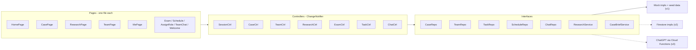

# Gavel v1: Iterative Build Plan

## Product description (north star)

> Gavel is a mock trial preparation app for student competitors that uses AI research and team collaboration tools to turn scattered case materials into a structured courtroom strategy. Mock trial teams typically juggle witness statements, evidence packets, opening and closing arguments, examination scripts, and timing rules across messy shared folders. Gavel consolidates everything into one workspace: case briefs are parsed by AI to surface key facts, evidence linkages, and likely opposing-counsel arguments; role assignments map each teammate to attorney or witness duties with their own task queues; a research hub collects precedents, legal definitions, and case-relevant articles with citation tracking; team chat, schedule, and prep checklists keep the build-out coordinated. By turning trial prep into a single AI-assisted collaborative workflow, Gavel helps student attorneys think more strategically, prepare more thoroughly, and walk into the courtroom with a unified team game plan.

Every iteration below delivers part of this description. In v1, the "AI" features run on mock data behind interfaces. In later versions, those interfaces are backed by Firebase and ChatGPT (see **Future plans**).

## Where each part of the description lives

- **One consolidated workspace** (witness statements, evidence packets, opening and closing arguments, examination scripts): Case tab (v0.5) and Examination Builder (v0.9)
- **AI-parsed case briefs** (key facts, evidence linkages, likely opposing-counsel arguments): the "Case brief" section in the Case tab (v0.5), using mock AI output in v1 and ChatGPT later
- **Timing rules**: the "Rules" section in the Case tab (v0.5), plus time estimate versus limit in the Examination Builder (v0.9)
- **Role assignments with task queues**: Team tab and Assign Role page (v0.7), plus "My tasks" in the Me tab (v0.8)
- **Research hub** (precedents, legal definitions, articles, citation tracking): Research tab (v0.6)
- **Team chat, schedule, prep checklists**: Team chat (v0.10), Practice Schedule (v0.8), and checklists in Me and Assign Role (v0.7, v0.8)
- **Unified team game plan**: team readiness on Home (v0.4) and Team (v0.7)

## Starting point

The repo is the default Flutter template. [lib/main.dart](lib/main.dart) is the counter demo, [test/widget_test.dart](test/widget_test.dart) is the counter test, and [pubspec.yaml](pubspec.yaml) only has `cupertino_icons`. The SDK is Flutter 3.47.6 / Dart 3.13.5. [ios/](ios/) already exists with deployment target iOS 15.0 and the placeholder bundle ID `com.example.gavel`.

## Target platforms and device testing

- **iPhone (main mobile target)**: the student builds on his Mac with Xcode and a connected iPhone.
  - One-time setup: install Xcode and CocoaPods, open `ios/Runner.xcworkspace`, sign in with an Apple ID under Signing & Capabilities, choose a Team, and change the bundle ID from `com.example.gavel` to something unique, such as `com.<team>.gavel`. On the iPhone, turn on Developer Mode and trust the developer certificate.
  - Run with `flutter devices`, then `flutter run -d <iphone-id>`. Run integration tests on the device with `flutter test integration_test -d <iphone-id>`.
  - iOS-specific checks in every UI iteration: safe areas (notch and home indicator) around the bottom nav, swipe-back gesture on pushed pages (`CupertinoPageTransitionsBuilder` in the theme), keyboard insets on the Research and chat input bars, and Dynamic Type at larger text sizes.
- **Android and web (Edge/Chrome)**: these are used on the Windows machine for quick iteration.
- **Done checklist for each iteration**: `flutter analyze` passes, `flutter test` passes, a manual smoke test on iPhone (Mac) and on Edge or Android (Windows), then commit and tag `v0.x`.

## Guiding rules for every iteration

- Small changes that build on the previous version. Each iteration is one feature slice and one tag.
- **One page per file.** Every screen is its own `*_page.dart` file. Widgets used only by that page go in the feature's `widgets/` folder, one widget per file. Pages never import another feature's widgets; anything shared moves to `lib/core/widgets/`.
- There is no backend in v1. Pages read data through **repository and service interfaces** backed by in-memory mocks, so later Firestore and ChatGPT implementations can be swapped in without changing the UI.
- State uses `provider` with `ChangeNotifier` controllers. Navigation uses `go_router` with a `StatefulShellRoute` for the five tabs.
- Every interactive or asserted widget gets a stable `ValueKey` (for example `nav_home`, `assign_role_submit`).
- The test tree mirrors `lib/`. Every iteration adds unit tests for its logic and widget tests for its pages.

## Architecture



## Folder layout (pages kept separate)

```text
lib/
  main.dart                         # runApp(GavelApp())
  app.dart                          # GavelApp: MultiProvider + MaterialApp.router
  core/
    theme/        gavel_colors.dart, gavel_typography.dart, gavel_theme.dart, spacing.dart
    router/       app_router.dart, routes.dart (route path constants)
    widgets/      gavel_card.dart, stat_tile.dart, section_header.dart, status_pill.dart,
                  tag_chip.dart, progress_bar.dart, initials_avatar.dart,
                  gavel_bottom_nav.dart, app_shell.dart, empty_state.dart
    keys.dart                       # shared ValueKey constants
  data/
    models/       case_file.dart, party.dart, exhibit.dart, witness.dart, affidavit.dart,
                  case_brief.dart, timing_rule.dart, teammate.dart, trial_role.dart,
                  role_assignment.dart, task_item.dart, practice_session.dart,
                  exam_question.dart, research_message.dart, research_source.dart,
                  citation.dart, chat_message.dart, user_profile.dart
    repositories/ case_repository.dart, team_repository.dart, task_repository.dart,
                  schedule_repository.dart, chat_repository.dart
    services/     research_service.dart, case_brief_service.dart
    mock/         seed_data.dart, mock_case_repository.dart, mock_team_repository.dart,
                  mock_task_repository.dart, mock_schedule_repository.dart,
                  mock_chat_repository.dart, mock_research_service.dart,
                  mock_case_brief_service.dart
  state/          session_controller.dart, case_controller.dart, team_controller.dart,
                  research_controller.dart, exam_controller.dart, task_controller.dart,
                  chat_controller.dart, teammate_matcher.dart
  features/
    onboarding/   welcome_page.dart, widgets/feature_card.dart
    home/         home_page.dart, widgets/active_case_card.dart, widgets/ask_case_card.dart,
                  widgets/assignment_tile.dart, widgets/team_readiness_card.dart
    case_file/    case_page.dart, widgets/case_header_card.dart, widgets/section_chips.dart,
                  widgets/overview_section.dart, widgets/case_brief_section.dart,
                  widgets/affidavits_section.dart, widgets/exhibits_section.dart,
                  widgets/stipulations_section.dart, widgets/rules_section.dart
    examination/  examination_page.dart, widgets/witness_hero.dart,
                  widgets/question_tile.dart, widgets/question_editor_sheet.dart
    research/     research_page.dart, source_detail_page.dart,
                  widgets/chat_bubble.dart, widgets/citation_chip.dart,
                  widgets/suggestion_chips.dart, widgets/research_input_bar.dart,
                  widgets/library_list.dart
    team/         team_page.dart, assign_role_page.dart, team_chat_page.dart,
                  widgets/roster_readiness_card.dart, widgets/member_tile.dart,
                  widgets/open_role_tile.dart, widgets/teammate_suggestion_tile.dart,
                  widgets/chat_message_tile.dart
    me/           me_page.dart, widgets/profile_hero.dart, widgets/my_task_tile.dart,
                  widgets/quick_access_grid.dart
    schedule/     schedule_page.dart, widgets/week_strip.dart, widgets/session_tile.dart,
                  widgets/weekly_goal_card.dart
test/             mirrors lib/ (one *_test.dart per page, controller, model, and repository)
  helpers/        pump_app.dart, fake_repositories.dart, test_clock.dart
integration_test/ app_flow_test.dart
assets/           fonts/, images/
```

## Design tokens (taken from the mockups)

- **Colors**:
  - Primary maroon `#7A2335`
  - Deep plum `#2B1820` for the dark Welcome and Research pages
  - Cream background `#F6F1EA`, white cards, gold accent `#C9A24A`
  - Status colors: ready `#3E8E5A`, in progress `#D69A2D`, flagged `#C2453D`, info `#3B6FB6`
- **Type**: a serif display font for hero titles and a sans-serif font for body text. Both are bundled in `assets/fonts/` (for example Fraunces and Inter) so that they render the same on iOS, Android, and web, and so golden tests stay deterministic.
- **Shape**: cards use 16–20px corner radius with a thin warm-grey border. Pills are fully rounded. The center Research tab is a raised maroon square button.
- **Images**: initials avatars and gradient heroes in v1. Photos are optional and go in `assets/images/`.

---

## Iterations

### v0.1: Foundation and theme
- Replace the template with `GavelApp`. Add `go_router`, `provider`, and `intl`, and bundle the fonts.
- Add `GavelTheme.light()` and `GavelTheme.dark()`. Both use iOS-style page transitions and swipe-back on all platforms.
- Add the core widgets (one file each) under `lib/core/widgets/`.
- iOS: set a unique bundle ID and display name "Gavel", then confirm it launches on the iPhone.
- CI in `.github/workflows/ci.yml`: an Ubuntu job runs `flutter analyze` and `flutter test`, and a macOS job runs `flutter build ios --no-codesign` so iOS build problems are caught early.
- Tests: theme values and rendering of each core widget. Delete the counter test.

### v0.2: Navigation shell
- `StatefulShellRoute.indexedStack` with five branches (`/home`, `/case`, `/research`, `/team`, `/me`). Each branch has its own page file with placeholder content.
- `GavelBottomNav` respects the bottom safe area on iPhone.
- Tests: all five nav items render, tapping each one switches tabs, tab state is kept when switching, and the app starts at `/home`.

### v0.3: Data models and mock repositories
- Immutable models with `copyWith`, `==`, and `toMap`/`fromMap` (shaped like future Firestore documents).
- Repository and service interfaces, with mocks seeded with State v. Harmon (14 exhibits, 6 witnesses, Officer Reyes, Mara Okafor, Sofia Reyes, Marcus Bell, and others).
- Tests: `toMap`/`fromMap` round-trip for each model, seed data invariants, and mock repository create/read/update behavior.

### v0.4: Home tab ("unified team game plan" at a glance)
- `home_page.dart`: header, active case hero ("State v. Harmon", days until trial, readiness bar), stats row (Exhibits, Witnesses, Team tasks), an "Ask the case" card that opens Research, "Your assignments", and a team readiness summary.
- Tests: readiness and countdown math using an injected clock, stats match repository counts, and "Ask the case" goes to `/research`.

### v0.5: Case tab (consolidated workspace and AI case brief)
- `case_page.dart`: case header card, then section chips for Overview, Brief, Affidavits, Exhibits, Stipulations, and Rules.
- The **Brief** section shows `CaseBriefService` output: key facts, evidence linkages (each fact connected to an exhibit or affidavit), and likely opposing-counsel arguments with suggested counters. In v1 this comes from a mock.
- The **Rules** section lists the timing rules (for example opening 5 min, direct 25 min total, cross 20 min total, closing 9 min).
- Tests: switching chips changes the content, the brief shows facts with working evidence links, the counts match the seed data, and the timing rules render.

### v0.6: Research hub (precedents, definitions, articles, citation tracking)
- `research_page.dart`: a dark page with two modes, **Ask** and **Library**.
  - **Ask** is the chat from the mockup: bubbles, numbered AI answers with citation chips, suggestion chips, and an input bar that stays above the iOS keyboard.
  - **Library** holds saved sources grouped by Precedent, Definition, and Article.
- `source_detail_page.dart`: a single source with its citation and a "Cited in" list that tracks where the source is used (AI answers, exam questions, the case brief).
- `ResearchService` interface, with `MockResearchService` returning keyword-matched answers that include citations.
- Tests: sending a message adds the user message, then a loading state, then the reply. Suggestion chips send their text. Saving a source adds it to the Library. "Cited in" updates when a citation is added.

### v0.7: Team tab and Assign Role page (roles and task queues)
- `team_page.dart`: roster readiness card, Prosecution / Defense / Witnesses segmented control, attorneys and witness roles, open-slot tiles, and an entry point to team chat.
- `assign_role_page.dart` (`/team/assign/:roleId`): role hero, a responsibilities checklist, and AI-match teammate suggestions from a pure `TeammateMatcher`. The "Assign {name} & notify team" button assigns the role and adds its responsibilities to that teammate's task queue.
- Tests: the matcher ranking rules, the segmented filter, the button label updating, assignment filling the slot, creating tasks in that teammate's queue, and raising readiness on Team and Home.

### v0.8: Me tab and Practice Schedule page (prep checklists and schedule)
- `me_page.dart`: profile hero, stats row, "My tasks" (your personal prep checklist from the task queue), and a quick access grid.
- `schedule_page.dart` (`/me/schedule`): countdown hero, week strip, upcoming sessions, and a weekly goal card.
- Tests: checking off a task updates the stats and Home, each quick-access tile opens the right route, the week strip filters sessions, and the weekly goal math is correct.

### v0.9: Examination Builder page (examination scripts)
- `examination_page.dart` (`/case/witness/:id/exam`): witness hero, stats (Drafted, Evidence-linked, Flagged), the examination goal, and the question line with exhibit tags.
- Add, edit, reorder, and delete questions. "Suggest with AI" uses mock suggestions. An estimated time is shown against the matching timing rule from v0.5.
- Tests: create, edit, reorder, and delete; stats recompute; linking an exhibit adds a tag and a "Cited in" entry; a warning appears when the estimate is over the limit.

### v0.10: Team chat page (coordination)
- `team_chat_page.dart` (`/team/chat`): a single team channel with message tiles and an input bar. Messages can mention a task or an exhibit. Uses `MockChatRepository` (local only in v1; real-time comes with Firestore).
- Tests: sending a message appends it, and tapping a mention opens the linked item.

### v0.11: Welcome / onboarding page
- `welcome_page.dart`: dark hero with "Win the room. Master the case.", three feature cards, and an "Enter the war room" button. A router redirect shows it on first launch.
- Tests: a first launch shows Welcome, the button goes to `/home`, and Welcome is skipped once the user is onboarded.

### v1.0: Polish, hardening, and full test pass
- Empty, loading, and error states on every list, tested with a `FailingFake` repository. Add semantics labels, checks at 1.3x text scale and with iOS Dynamic Type, and a maximum content width on web.
- Golden tests for each page at an iPhone size (390x844), using bundled fonts.
- `integration_test/app_flow_test.dart` runs on both a physical iPhone and Android. The flow: Welcome, Home, Research (ask a question and save a source), Case brief, Team (assign the closing attorney), team chat, Me (check off a task), then Schedule.
- At least 80% coverage on `lib/state` and `lib/data`. Update [README.md](README.md) with setup steps, including Mac/Xcode/iPhone steps, test commands, and the version history.

## Test suite structure (cumulative)

- `test/core/`: theme, widgets, and router
- `test/data/`: models, mock repositories, and mock services
- `test/state/`: controllers and `TeammateMatcher`
- `test/features/<feature>/<page>_test.dart`: one test file per page
- `test/golden/`: visual regression tests (v1.0)
- `integration_test/`: full flows, run on iPhone, Android, and web
- `test/helpers/pump_app.dart`: `pumpGavelApp(tester, {overrides, initialLocation, clock})` builds the real router and providers with fake repositories.

---

## Future plans

### v2: Firebase and Firestore (accounts, shared team data, real-time sync)
- **Setup**: create a Firebase project, run `flutterfire configure` for iOS, Android, and web, and add `firebase_core`, `firebase_auth`, `cloud_firestore`, and `firebase_storage`. iOS 15 already meets the Firebase minimum. On iOS, add `GoogleService-Info.plist` through FlutterFire.
- **Auth**: email or Google sign-in, plus Sign in with Apple (required by App Store rules when other social logins are offered). Users join a team with an invite code. This replaces the local `onboarded` flag.
- **Data model** (the v1 `toMap`/`fromMap` shapes map directly to these):
  - `teams/{teamId}`, with subcollections `members`, `cases/{caseId}`, `tasks`, `sessions`, and `chat`
  - `cases/{caseId}`, with subcollections `exhibits`, `witnesses`, `affidavits`, `brief`, `exam_scripts`, and `sources`
- **Swap-in**: add `Firestore*Repository` classes that implement the v1 interfaces and use streams for live updates. Team chat, task queues, and readiness then sync in real time across teammates' phones. Turn on offline persistence for practice rooms with poor signal.
- **Storage**: upload case packet PDFs and exhibit images to Firebase Storage.
- **Security rules**: only team members can read or write their team's data, and only the captain or coach can assign roles. Rules are tested with the Firebase Emulator Suite.
- **Notifications**: Firebase Cloud Messaging (FCM) for "you were assigned a role", new chat messages, and practice reminders. iOS needs an APNs key and the push capability in Xcode.
- **Testing**: unit tests use `fake_cloud_firestore` and `firebase_auth_mocks`; CI runs integration tests against the Firebase emulators.

### v3: ChatGPT as the LLM for the AI researcher and case brief
- **Never ship the OpenAI API key in the app.** The app calls a Firebase Cloud Function (`researchAsk`, `parseCaseBrief`, `suggestQuestions`). The function checks the Firebase Auth user and team membership, then calls the OpenAI API with the key stored in Secret Manager.
- **Swap-in**: `OpenAIResearchService` and `OpenAICaseBriefService` implement the existing v1 interfaces, so the Research, Case brief, and Examination pages don't change.
- **Grounded in the case**: when a case packet is uploaded, a function extracts its text, splits it into chunks, and stores embeddings. Questions retrieve the most relevant chunks (retrieval-augmented generation, or RAG), and the model must cite them. This keeps answers tied to the case record instead of invented facts.
- **Structured output**: ask the model for JSON matching a schema (answer points, plus citations with source ID and page). The app renders these as the same citation chips and "Cited in" tracking from v0.6.
- **Case brief parsing**: one call per packet produces key facts, evidence linkages, and likely opposing-counsel arguments, stored in `cases/{caseId}/brief`.
- **Product guardrails**: stream responses for a fast-feeling chat, rate-limit and cap usage per team, use a system prompt aimed at students (explains reasoning and doesn't write full scripts unless asked), and add moderation checks.
- **Testing**: the services are tested with a fake HTTP client and recorded JSON responses, the Cloud Functions are tested in the emulator, and a small evaluation set of case questions with expected citations is used to check answer quality.

### Later ideas
Coach and judge views, scrimmage scoring with ballots, a timer mode for live practice, and an iPad layout.
